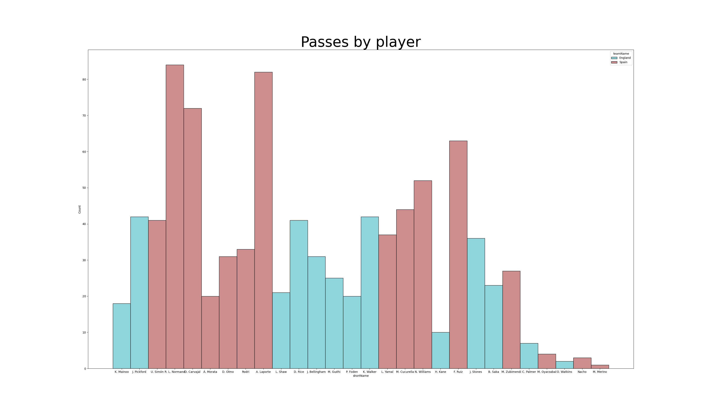
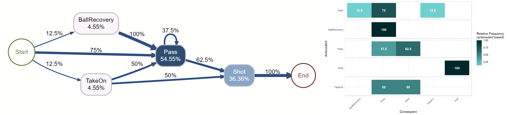
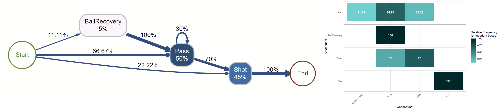
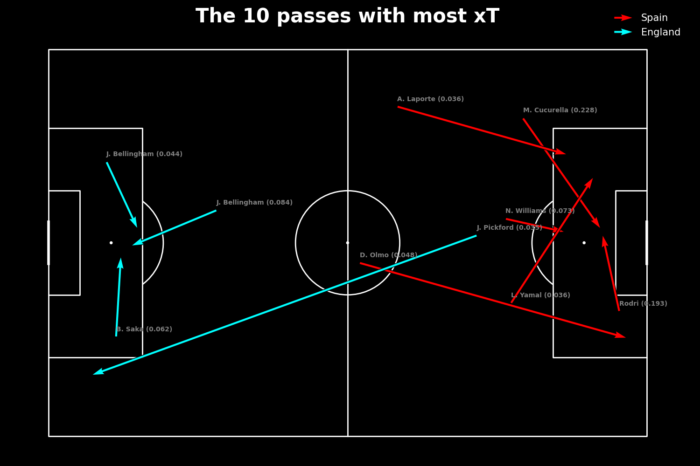

# Visualisation of the 2024 Euros Finals (Spains vs England)
I've used the dataset available [here](https://www.kaggle.com/datasets/rohanraoeravelli/euros-finals-dashboard) 
in order to create some visualisations to have a better understanding of what happened during the match. 

## Some general info

Here we have some general information about the match. What really stands out are the amount of passes done by Spain, almost the double of England's, and the difference in possession.\
Except the number of corners, the rest is not so different.

## Pass analysis
Since the main difference between both teams (according to the pizza plot) are the passes and the possession, I wanted to take a closer look.

### Histogram of passes by player

I wanted to know exactly how many passes each player did. 
The first six players with most passes are Spanish players: the 4 defenders, the left midfielder (Fabián Ruiz) and the left winger (Nico Williams). All of them have more than 40 passes.
England, in the other hand, only has 3 players with more than 40 passes: their goalkeeper (Pickford), one defender (Walker) and one midfielder (Rice).

### Pass plots
After knowing who were the players with the most passes, I thought it would be interesting to know where did thoses passes happen.\
I made a plot for each team and for each period for better readability.

For the Spanish team, we see a big number of passes made in the opponent midfield, with somewhat of an arch going from the wingers positions back to the midfield specially during the first half.
In fact, we see a lot of pressure coming from the sides, reflecting on the importance of the wingers (Nico Williams on the leftside and Lamine Yamal on the rightside).\
During the second half, less passes seem to happen in the opponent midfield, but the arch is still there aswell as the pressure from the wingers (specially from the rightside).

For the English team, there is a clear difference between the two periods.\
During the first, few passes are made and the majority happens in their own field (midfield and defense).
But during the second period, they seem to play further and the arch appears aswell as the pressure from the wingers. They also seem to play more on the right side of the field.
This change in playstyle may be due to Spain scoring the first goal at the 47th minute.

### Passing networks
Let's see now the passing networks for both teams during both periods.\
I used an index of centralisation (i.e. how distributed the passes are between players), with 0 being totally decentralised and 1 being completely centralised in one player, in order to quantify a team's centralisation and compare it. Usually, the more centralised teams' passing networks are, the less succesfull the teams are. Here we have to keep in mind that the fewer the passes, the less accurate it is.\
More [here](https://soccermatics.readthedocs.io/en/latest/lesson1/passnetworksExample.html).

First, we see that the defense line is quite pushed, playing in the midfield, and then we see that Rodri is playing almost in the middle of the network, passing to everyone almost equally.\
Secondly we see several important sub-networks:
- There is one between Carvajal, Le Normand, Laporte and Cucurella, that allows to carry the ball from one side to another easily.
- There is also one between Laporte, Le Normand and Rodri, with Rodri being a key player since, after receiving the ball from Laporte and Le Normand, distributes the ball to everyone.
- We have the networks on the sides with Carvajal passing to Yamal, and Cucurella distributing to Laporte, Ruiz and Williams.

Lastly, we see that the index of centralisation is quite high, but it does not seem to be a problem since it is really centralised on the defense and not on a single player that could be easily neutralised.

During the second half of the game, there are a few changes:
- The defense line goes back.
- The network is way more decentralised, with the lowest index of the match.
- Fabián Ruiz plays more in the middle, assuming part of Rodri's role during the first period.
- Carvajal plays way further, almost next to Yamal, in order to better distribute the ball (maybe also in order to cover Rodri's absence). He receives and gives more passes from/towards the midfield (Ruiz) that from/towards the defense (Le Normand).

First, we see that every player usually plays in their own field except for just two players: Bellingham and Saka. Foden should be playing further, closer to Saka and at the same level as Bellingham, since they are both wingers in this match.\
The various sub-networks here are:
- Stones, Walker and Pickford.
- Walker, Mainoo and Saka.
- Pickford, Stones, Rice and Guéhi.
- Jude Bellingham distributing to Shaw, Rice and Kane and Rice being the key player in the middle.

The index of centralisation is quite good (and better than the Spanish one for the first half) but we have to remember that the number of England passes is low for the first period.

We can see some changes here:
- More aggressive playstyle: they play further now.
- Foden is playing alongside Bellingham but with less passes.
- Rice is even more key to the distribution of the ball: strong edges to Stones, Guéhi, Bellingham and Walker.
- Walker and Guéhi have bigger roles in the sides: Guéhi passes to Stones, Rice, Bellingham and Shaw, Walker has a strong edge with Saka and distributes more the ball (like Carvajal).
- Index of centralisation is higher.

## Players heatmaps

After having a look at the passes of the teams, we are going to concentrate on the wingers of both teams using their heatmaps.

We see that the Spanish players are more aggressive than the English players. Lamine Yamal seems to never go in Spain's field, and Phil Foden has a really spreaded heatmap.

## Process mining for the last two actions leading to shots

Let's look at the process maps and matrixes of the two actions preceding a goal for both teams.

### Spain process map and process matrix for the last two actions leading to shots (relative-antecedent)

### England process map and process matrix for the last two actions leading to shots (relative-antecedent)

We see that there is no significative difference in terms of structure between the two: almost every shot is preceded by a Pass. 
The only real difference is that 12.5% of the shots are preceded by a TakeOn for Spain, and 22.22% of the shots come from a direct shooting opportunity for England.  

## Expected Threat (xT) analysis
### What is expected threat or xT
Expected Threat (xT) is calculated by laying a 'value surface' over a football 
pitch to divide it into zones, where each zone has a value assigned to it based 
on how likely a goal is to be scored from that zone. Players can then be credited for moving the ball from zone to zone.
The term "Expected Threat" was introduced by Karun Singh in 2018, but it is based on Sarah Rudd's work of her research 
and [presentation](http://nessis.org/nessis11/rudd.pdf).\
Based on Markov chains, it is arguably the most known possession value model in the industry.

### Total xT by player
Let's take a look at the expected threat created by each player.

We first see two players have a clear superior xT than the rest: Rodri and Cucurella. This is shocking considering Rodri only played the first half of the game.\
Among the top 5, there is only one English player, and among the top 10, three. If we look at the players that created a "negative threat", three out of the nine players are English, with both the wingers (Bellingham and Phoden) being there. On the Spanish side, the "worst" player is Morata followed by Oyarzabal, both playing in the same position (Oyarzabal replaced Morata at the end of the match).\
The English player with the most cumulated xT is Pickford, their goalkeeper.

### Expected Threat cumulated by minute

Now, if we look at the xT cumulated per minute, we see two big positive peaks from Spain at the 12th minute and around the 88th minute. These correspond to the two passes with most xT, made by Rodri and Cucurella. There is another peak, this time negative, corresponding to the assist Bellingham did to Palmer. Since it was a pass to the back (and Bellingham was inside the penalty area), the expected threat gains are negative, independently of the outcome of the next action.

### The 10 passes with most xT

Here we have the 10 passes with most expected threat. 
Six are Spanish passes with one from inside the penalty area, 
and four are English passes, with two from inside the penalty area.
We can see the passes from Rodri and Cucurella corresponding to the peaks we talked about earlier.
### Passes with more than 0.02 xT

Next we have the passes with more than 0.02 xT for both teams.\
The main difference is the amount of passes that differs between Spain and England. 
In fact, we see that Spain has 10 passes and England just 6. 
We also see that the left wing lacks passes for the English team, at least compared to Spanish team.

## Positional 20 analysis based on expected threat (xT)
Now let's combine the expected threat analysis with the Positional 20 concept.
### What is Positional 20 (or Juego de Posición) ?
Positional 20, or Juego de Posición, consists in dividing the pitch in 20 zones in order 
to better visualize and organize your tactics and playstyle in general. 
It was really developed in modern football by Pep Guardiola, 
but it is based on Johan Cruyff ideas at FC Barcelona.\
I wanted to combine the expected threat analysis with this concept to get a better insight of the game.

Here you have what this layout looks like.

### Total xT per zone by team

Here we have the total xT per zone for each team. In general, it is higer for 
the Spanish team, with the big differences in the opponent's penalty area (zone 19), 
the left wing (zones 11 and 12) and part of middle-right wing (zones 15 and 17).\
But England also has some zones with more xT than Spain: their own penalty area (zone 2) and 
their middle and right side of the defense (zones 7 and 8).

### Best player per zone (based on their total xT)
To better understand the differences, we can look at the best 
players in each zone considering their total xT created.

Out of 20 zones, we have 12 zones with Spanish players and 8 zones with English players.
But in reality, we have 7 unique Spanish players and 5 unique English players: 
every Spanish appears at least two times except for Rodri, Cucurella and Unai Simón, and for the English team, 
Pickford appears three times and Walker two times.\
The left wing and right wing are (almost) dominated by the Spanish team, with Yamal 
appearing three times. The center of the midfield is, in the other hand, "controlled"
 by England with Pickford and Bellingham.

## Ressources used and eventual limits
I essentially used the [mplsoccer documentation](https://mplsoccer.readthedocs.io/en/latest/#) and the [soccermathics website](https://soccermatics.readthedocs.io/en/latest/), 
with the latter particularly for the passing networks, their centralisation and the expected threat analysis.\
This project was almost entirely made with Python and these libraries: pandas, matplotlib, numpy, mplsoccer, seaborn, highlight_text.\
I only used R for the process mining part, using the bupaverse and dplyr libraries.\
The dataset is in csv format.\
All the images are entirely made by me, and all the data comes from the dataset (except the possession percentages of the pizza plot, the source is in the code).
I also used [https://imageonline.co/merge-png.php](https://imageonline.co/merge-png.php) to merge some plots for better readability on this file, but all the images are made with Python and R.\
Some minutes marks may vary from the real ones: the second goal happens in the 86th minute and note in the 88th, for example. This is because I used the extendedMinute variable during the analysis (to avoid repeated values), so the second period begins on the 47th minute. 

